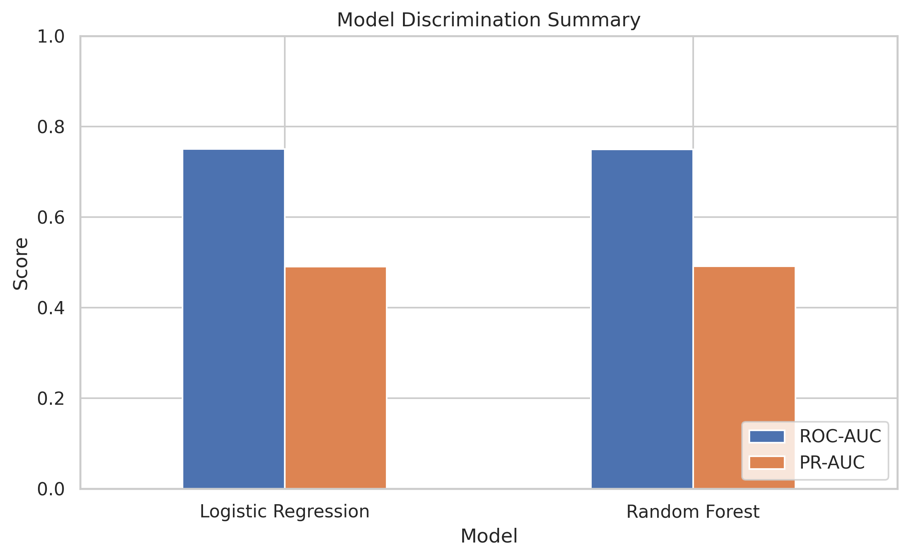
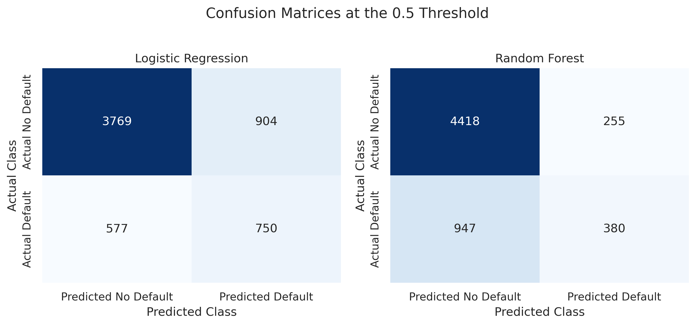
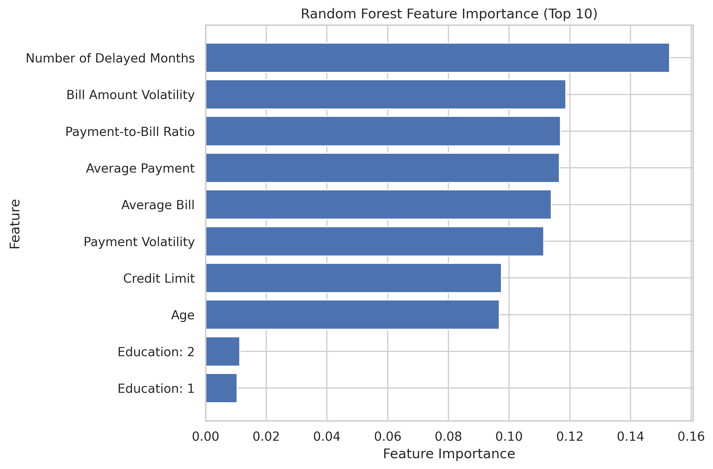
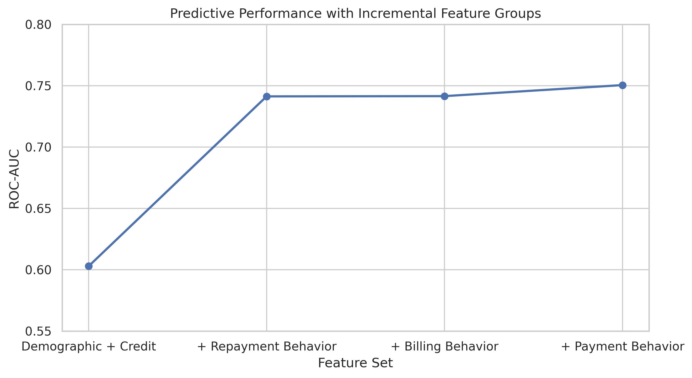
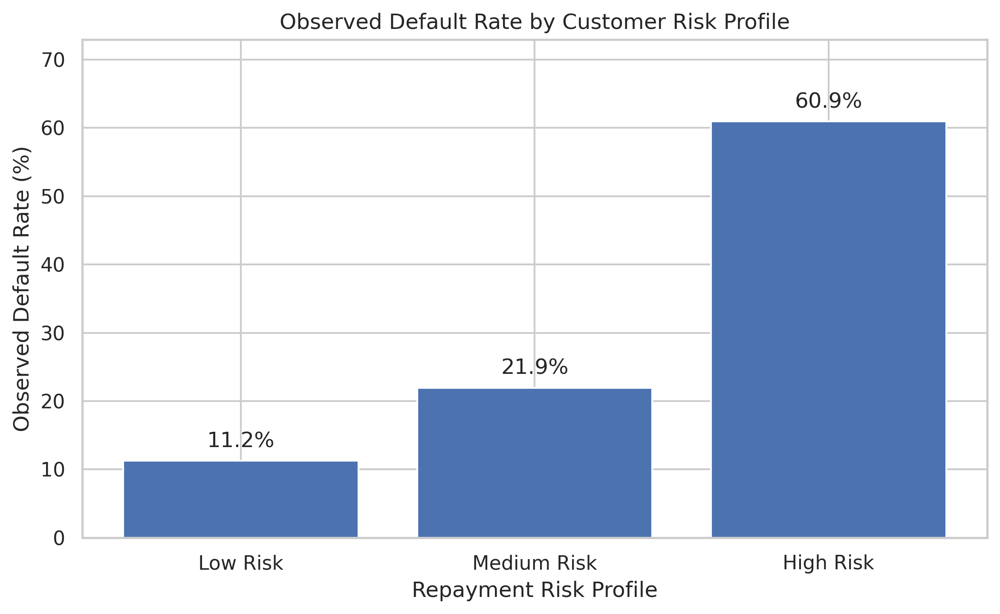

# Credit Default Prediction and Customer Risk Profiling

> **1-minute portfolio view:** a finance-domain data science project combining exploratory analysis, feature engineering, statistical reasoning, Logistic Regression, Random Forest, model evaluation, and interpretable customer risk profiling.

## 1. Project Background and Objective

Credit-risk analysis is a practical setting where data quality, customer behavior, model performance, and decision trade-offs all matter. This project asks:

**Can historical customer characteristics and payment behavior provide useful information for predicting credit card default?**

The project was designed as an academic/portfolio study rather than a production credit-scoring system. The emphasis is on an end-to-end workflow and responsible interpretation of associations in a public dataset.

## 2. Dataset

The analysis uses the **Default of Credit Card Clients** dataset from the UCI Machine Learning Repository.

- **30,000 observations**
- **23 original variables**
- Target: `default.payment.next.month`
- `0` = no default
- `1` = default
- Observed default share: **22.12%**

**Data source:** Yeh, I.-C. (2009), *Default of Credit Card Clients* [Dataset], UCI Machine Learning Repository, DOI: 10.24432/C55S3H.

See [`data/README.md`](data/README.md) for the download source and local file instructions. The raw CSV is intentionally not committed to GitHub.

## 3. Methods Overview

### Data preparation

The workflow checks dataset structure, missing values, duplicates, variable distributions, target imbalance, and unusual billing values before modeling. Numeric preprocessing uses median imputation and standardization; categorical variables are one-hot encoded.

### Feature engineering

Customer-level behavioral features include:

- `delay_months`: number of months with a positive recorded repayment delay
- `avg_bill_amt`: mean six-month bill amount
- `bill_amt_std`: six-month bill volatility
- `avg_payment`: mean six-month payment amount
- `payment_std`: six-month payment volatility
- `payment_to_bill_ratio_capped`: cumulative six-month payment-to-bill behavioral proxy
- `ratio_missing`: indicator for cases where the ratio cannot be meaningfully calculated

### Models

- **Logistic Regression** — interpretable linear baseline
- **Random Forest** — nonlinear comparison model

Because defaults are a minority class, evaluation uses Accuracy, Precision, Recall, F1, ROC-AUC, PR-AUC, confusion matrices, ROC/PR curves, and threshold analysis rather than Accuracy alone.

## 4. Key Results

### Model performance

| Model | Accuracy | Precision | Recall | F1 | ROC-AUC | PR-AUC |
|---|---:|---:|---:|---:|---:|---:|
| Logistic Regression | 0.7532 | 0.4534 | 0.5652 | 0.5032 | **0.7505** | 0.4901 |
| Random Forest | **0.7997** | **0.5984** | 0.2864 | 0.3874 | 0.7494 | **0.4914** |

The two models have very similar ROC-AUC and PR-AUC values, while their precision-recall trade-offs differ at the 0.5 threshold. The project therefore does **not** claim that one model is universally better; the operating point depends on the relative cost of missed defaults and false alerts.

### Model discrimination summary



*Recorded ROC-AUC and PR-AUC values from the project run. The notebook generates the full ROC curve after the raw dataset is loaded.*

### Confusion matrices



At the 0.5 threshold, Logistic Regression identifies more default cases (higher Recall), while Random Forest produces fewer false positives (higher Precision). These are different error profiles, not simply a better/worse ordering.

### Random Forest feature importance



The top features are dominated by repayment, billing, and payment behavior, especially delayed months, bill volatility, payment-to-bill behavior, and average payment. These are impurity-based importances and should be interpreted descriptively, especially because correlated predictors can share importance.

### Feature-group contribution



The recorded feature-group analysis shows:

- Demographic + Credit: **ROC-AUC 0.6029**
- + Repayment Behavior: **0.7413** (**+0.1384**)
- + Billing Behavior: **0.7415** (**+0.0002**)
- + Payment Behavior: **0.7505** (**+0.0090**)

This is the clearest quantitative result supporting the project's central story: repayment behavior contributes the largest incremental predictive information among the feature groups tested, while billing adds little once repayment behavior is included.

### Customer risk profiling



The descriptive repayment-risk profiles show large differences in observed default rates:

| Profile | Customers | Observed default rate |
|---|---:|---:|
| Low Risk | 13,562 | **11.24%** |
| Medium Risk | 11,848 | **21.94%** |
| High Risk | 3,519 | **60.93%** |
| Unknown | 1,071 | **34.36%** |

The **Unknown** group is kept separate because its payment-to-bill ratio is not meaningfully available. The profiles are rule-based descriptive summaries, not model prediction labels or causal risk categories.

## 5. Main Conclusions and Business Insights

### 1. Repayment behavior is the strongest incremental information source

Adding repayment behavior increased ROC-AUC from **0.6029 to 0.7413**, the largest step in the feature-group analysis. This suggests that historical repayment behavior carries substantial information for distinguishing default outcomes in this dataset.

### 2. Payment behavior adds information beyond delay counts

Payment-to-bill behavior and payment amount measures add a smaller but measurable improvement after repayment and billing variables are already included. This supports using more than one repayment-related feature rather than relying on delay count alone.

### 3. Risk profiles translate model-adjacent results into understandable customer patterns

Customers in the High Risk descriptive profile are characterized by more payment delays and a lower payment-to-bill ratio, and the profile has a much higher observed default rate than the Low Risk profile. This makes the analysis easier to communicate to a non-technical audience.

### 4. Model evaluation should consider error trade-offs

The two models have similar ranking performance but different Precision/Recall behavior at the default threshold. In a real credit-risk setting, threshold selection would need explicit business costs for false positives and false negatives.

## 6. Limitations

- The analysis uses a single public dataset, so the results may not generalize to another bank, country, or customer population.
- The data are observational; associations should not be interpreted as causal effects.
- Engineered variables such as `delay_months` and `payment_to_bill_ratio_capped` are simplified behavioral proxies.
- The main evaluation uses one stratified 80/20 hold-out split with `random_state=42`.
- Real deployment would require stronger validation, probability calibration, monitoring, governance, fairness analysis, and out-of-time or external validation.
- Random Forest impurity importance is descriptive and can be affected by correlated features.

## 7. Reproduction

### 7.1 Install dependencies

```bash
pip install -r requirements.txt
```

### 7.2 Add the dataset

Download the UCI dataset referenced in [`data/README.md`](data/README.md) and place the CSV at:

```text
data/default_of_credit_card_clients_dataset.csv
```

The notebook also includes fallback local Windows paths for the dataset.

### 7.3 Run the notebook

Open:

```text
notebooks/Credit_Default_Project.ipynb
```

Run the cells from top to bottom. The notebook is written to generate the model results and save model-specific figures under `figures/`.

### 7.4 Regenerate the README summary figures

The committed summary figures can be regenerated from the recorded result tables with:

```bash
python src/generate_portfolio_figures.py
```

### 7.5 View the HTML report

A notebook HTML export is provided at [`reports/Credit_Default_Project.html`](reports/Credit_Default_Project.html). For the most faithful interactive reproduction, run the notebook locally with the raw dataset available.

## 8. Repository Structure

```text
Credit-Default-Prediction/
├── README.md
├── requirements.txt
├── .gitignore
├── data/
│   └── README.md
├── figures/
│   ├── 01_model_discrimination_summary.png
│   ├── 02_confusion_matrices.png
│   ├── 03_random_forest_feature_importance.png
│   ├── 04_feature_group_contribution.png
│   ├── 05_customer_risk_profile_default_rate.png
│   └── README.md
├── notebooks/
│   └── Credit_Default_Project.ipynb
├── reports/
│   ├── Credit_Default_Project.html
│   ├── model_results.csv
│   ├── feature_importance.csv
│   ├── feature_group_results.csv
│   ├── customer_risk_profiles.csv
│   ├── confusion_matrices.csv
│   └── README.md
└── src/
    └── generate_portfolio_figures.py
```

## 9. Academic Positioning

This is a self-directed portfolio project connecting financial-domain experience with practical data science. It demonstrates an end-to-end workflow—**data understanding → feature construction → modeling → evaluation → interpretation → communication**—without overstating the project as a production credit-scoring solution.

> All documented project results are associations observed within the public dataset. They should not be read as causal claims or as evidence that the models are ready for real-world lending decisions.
